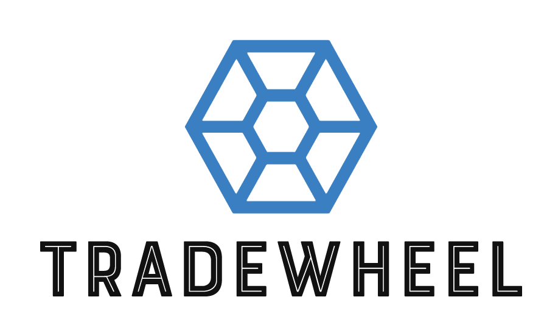

# Web3 - Fast and Secure Borderless Business

## (Contract Signing, Escrow Payment, International Arbitration)

Version 1.0
## Preface:

Tradewheels is a “Tradefi” dapp offering key services to traders, seller and buyers and contractors on web3 technology:

1) Electronic signing of legal contracts.
2) Escrow payments.
3) International Arbitration in case of litigation

Here the main workflow

Advantages:
1)	Fast and reliable exchange of signed agreements.
2)	Immediate escrow payments in crypto currency to guarantee both parties.
3)	Fast and independent international arbitration with 3 arbitrators for low fees.
 

## Electronic Signing of Contracts:

a)	Identification of the user identity:
The user may identify himself a valid ID on camera session or relay on the mail account. Here the main workflow:
 

b)	Contract templates:
The web app proposes a rich set of contract templates ready for the use, supplied from contributors that are rewarded whenever their template is used.
 
c)	 The user may load his own contract and select the places the signature shall be applied.
d)	The counterparts will be alerted by email of the requested signature.
e)	The counterparts can customize the signature with their own style of load a graphic file.

f)	The contracts are encrypted against public key of the counterparts and stored on IPFS. The addresses of the IPFS files is stored on the blockchain.

g)	The signed contracts are downloadable by pdf with the signatures and a verification link with QR code for any third part verification.

h)	Traceability: The contracts are historically stored with all the revisions.

Advantages:
1) Secure identification of the counterpart
2) Rich selection of templates for common agreements
3) Permanent storage of the contracts.
4) Impossibility in tampering signatures.
5) Fast and secure exchange of signed contracts.
6) Strong security by multiple layers of encryptions

##Escrow Payments:
The contract execution may require for a payment in an escrow account.  The escrow payment shall be done in crypto currency. Once the buyer approves, the payment locked in the escrow account will be released. If there are litigations, the arbitration result will trigger the release or return of the deposited sum. Here is the workflow:

 

The protocol will collect the protocol fees once the agreement is ended. 

## Arbitration:
Lawyers may apply to contribute as arbitrator; they should stake a certain number of tokens in refundable guarantee. The flow is the following:

 
The parties shall deposit their notes and supporting documents to sustain their reasons.
The initiating party shall deposit the arbitration fees.
3 arbitrators will be randomly selected. They will vote a resolution, with no visibility about the name of the entities involved and the decision of the others till everybody has not voted. The majority of votes wins the decision that can be:
a) full payment to seller.
b) partial payment to seller.
c) full refund to buyer.
d) partial refund to buyer.
If an arbitrator makes xx decisions in contrast with the result, his/her ranking will be reduced till a total exclusion from being an arbitrator.
The arbitrator is rewarded with a percentage on the amount of the funds in escrow account.
In case of different amounts between the winning arbitrators, the average will be computed and applied.

Agreement Templates:
Contributors may contribute with agreement templates to be used on the platform and rewarded every time a template is used.
The contributors may be requested to stake some funds to guarantee they are authors of the templates loaded. 
Here the upload process:
 

The selection and reward process:

 

In case of claim of copyright violation from a third part an arbitration procedure will be open. The stake may be used to cover the expensed of arbitration procedure.
The third part claiming a copyright violation may be requested to deposit some funds to open the arbitration. In case of win the funds will be returned.

## Encryption:

The agreement as the sensitive contract data must be properly encrypted, to permit only the recipients to access them.

Each user will publish on chain his/her own public keys signed from the wallet (auto-certification, no certification authority).
The keys pairs are derived from the secret seed of the wallet or a different one.

 
Since we wish to introduce a post-quantum algorithm, we will use a hybrid model to exchange the secret keys, with Elliptic Curve SEC521R1 + Kyber-1024.
We exchange a 512-bit key using SEC521R1 and a different 512-bit key using Kyber-1024.

The data is recursively encrypted by:
1) Aes-256 with the first 256 bit of key 1.
2) Camellia-256 with the second 256 bit of key 1.
3) Chacha-20 with the first 256 bit of key 2.
4) Aes-256 with the second 256 bit of key 2.

Here the encryption flow:

And here the decryption flow:

 

The encryption/decryption above is totally end-to-end.

The contracts are the main object to be fully encrypted to allow only the recipients to read them. In case of arbitration the contract will be visible to the arbitrators for the decision. The name if the parties are replaced with part 1 and part 2.

Ref. https://pq-crystals.org/kyber

Authentication:
Authentication is done signing the access by the regular crypto wallet. The security level is the one of the underlaying blockchain. 

## Document Storage:
The encrypted documents are stored in a private IPFS cluster for further privacy. 
Only the address of the file in IPFS is stored on chain.  
  

For the MVP (minimum viable product) we will use the public IPFS and encrypted data.
Technically we could use the public IPFS, but many of business prospect user seems more comfortable for private IPFS even if someone must keep up the infrastructure.
A proper high resilience plan should be done for the private IPFS cluster.

Ref: https://ipfs.tech/

## Protocol fees:

The protocol is rewarded by:
-	Fees on the contract exchange and permanent storage (IPFS).
-	Fees on the escrow account.
-	Fees on the arbitration.
The fees are changeable on the smart contracts from the owner.

## Data Definitions:
The data to be stored on chain is described in this document .

## Milestones:

1)	Develop Smart Contracts and encryption library. (60 days)
2)	Third part auditing of the smart contracts and encryption library (parallel with UI development).
3)	Develop UI for agreement signing, storing, retrieving. (60 days)
4)	Develop UI for escrow payments management. (60 days)
5)	Develop UI for Arbitration management. (90 days)
6)	Internal Auditing of UI development. (in parallel with development)

The UI milestones (2,3,4) may be developed in parallel, depending on the resources available.

The encryption library will be developed in Javascript/Typescript to be easily used in the UI development. 
Each milestone includes proper documentation for installation and running the modules.

